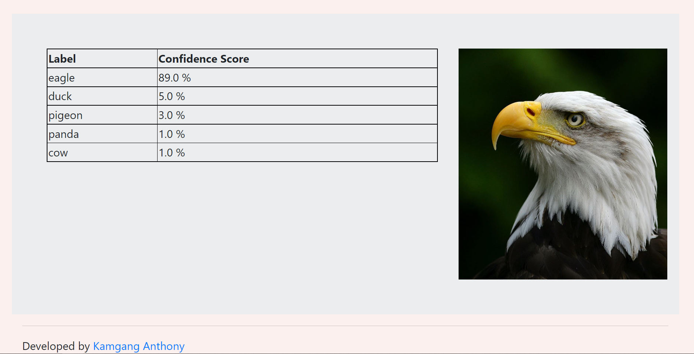

# Animal-Recognition-Image-Processing

<p align="center">
  <a href="https://animal-image-processing.herokuapp.com/">
    
  </a>

</p>

This web app recognizes animals from their images using machine learning.

* Created a tool that recognizes an animal(>80% precision) when a user imports an image into it.

* This aids wildlife industries in recognizing animals for a variety of purposes (research, studies, etc.).

* Over 1500 animal images were used to create the model(may be updated).

* It takes an image as input and changes it to grayscale, no matter what size it is. It then does a hogs transformation and gives probabilities of the animal in the picture.

* Optimized SVM, KNN, SGD, and logistic regression, even checking learning curves to find the best model.

* Using Flask, I created a client-facing API.

* Add an image. Get the name of the animal in it. [Try it!!!](https://animal-image-processing.herokuapp.com/)

## Resources and Code

**Python Version:** 3.10.5 

**Packages:** pandas, numpy, scikit-learn, scikit-image, scipy, flask, pickle, matplotlib, os, re, glob          

**For Web Framework Requirements:**  ```pip install -r requirements.txt```   

**Heroku Productionization:** https://animal-image-processing.herokuapp.com/

## Animal Types

The following animals were in the data:

* 'bear', 'cat', 'chicken', 'cow', 

* 'deer', 'dog', 'duck', 'eagle',

* 'elephant', 'human', 'lion', 'monkey', 

* 'mouse', 'natural', 'panda', 'pigeon',

* 'rabbit', 'sheep', 'tiger', 'wolf'.

## Finding the data | Transforming it

I created paths towards the different image files and got them in an array.

Then, I applied the following transformations on the image array:

* Converted it grayscale

* Appropriately resized and scaled

* I used a hog transformer to convert it into a format that the model could understand.

* Appropriately resized and scaled

* Standardized the array

* Fit into the model

## Model Building 

I tried four different models and evaluated them using cohen kappa score. I chose cohen kappa score because it is relatively easy to interpret and particularly suited for image recognition scores.   

In addition, to ensure that the models were not overfitting, I plotted their learning curves for test and training data and immediately identified which ones were poor.

Why did I choose these four different models:

*    **Stochastic gradient descent** – Since the data is unconstrained.

*    **Logistic Regression** – I thought there it could detect a logical pattern in an animal's shape after being hog transformed for example.

*    **KNeighborsClassifier** – Again, since it groups neighbors, it could be suitable for grouping the hog transformed area and finding patterns.

*    **Support Vector Machine** – Since there may be outliers(like different animals having the same shape), I thought SVM could capture that.

## Model performance

The SVM model outperformed the other approaches on the test and validation sets and did not overfit.

*    **Support Vector Machine** : CKS = 82.05%

*    **Logistic Regression**: CKS = 77.43%

*    **KNeighborsClassifier**: CKS = 62.61%

*    **Stochastic gradient descent**: CKS = 56.4%                

CKS = Cohen Kappa Score. >50% is usually good.

## Productionization 

In this step, I built a Flask API endpoint that was hosted on Heroku. The API webpage takes a photo of an animal and outputs the name of the animal that is in the photo.        

https://animal-image-processing.herokuapp.com/
